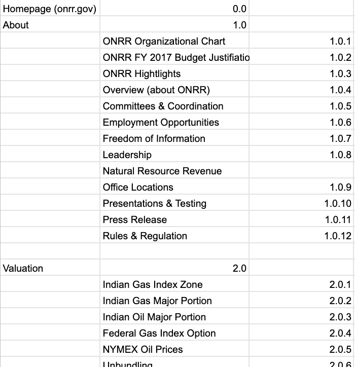
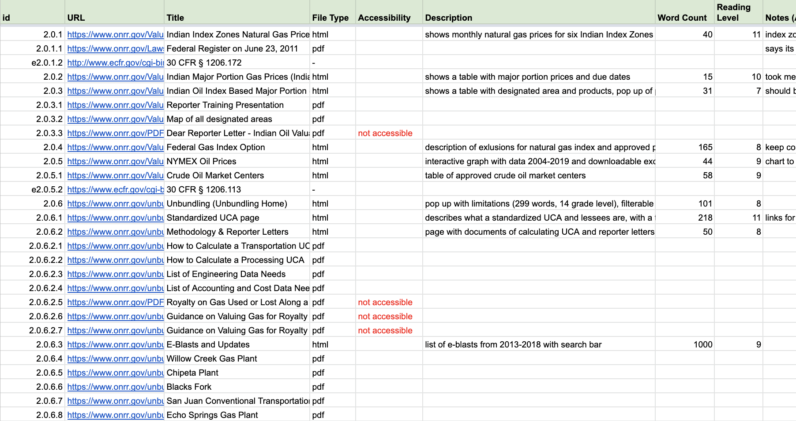
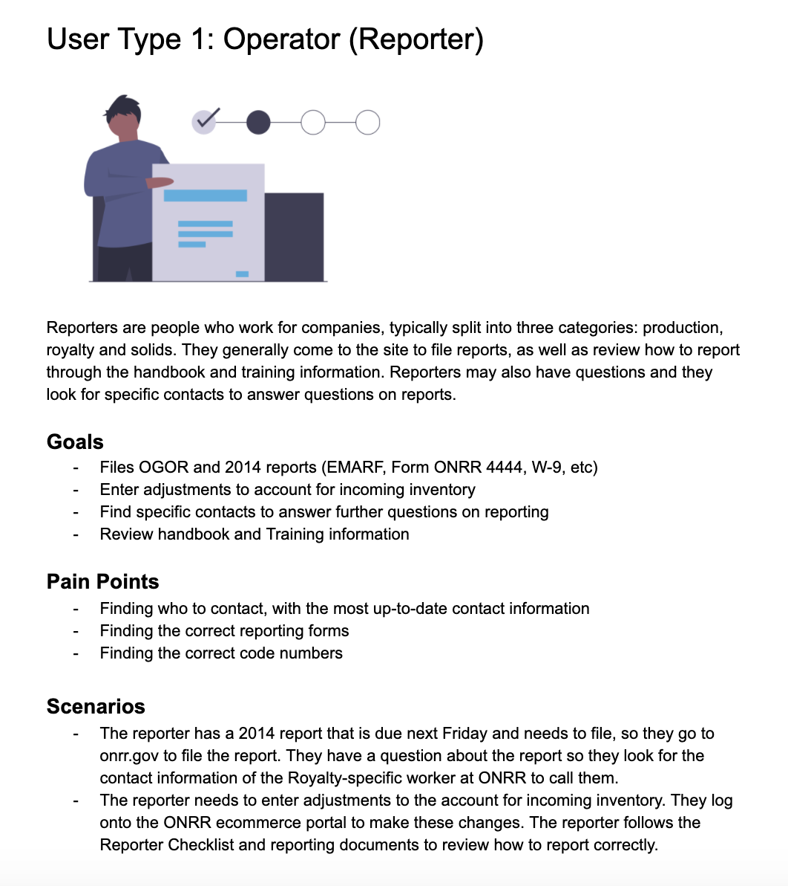
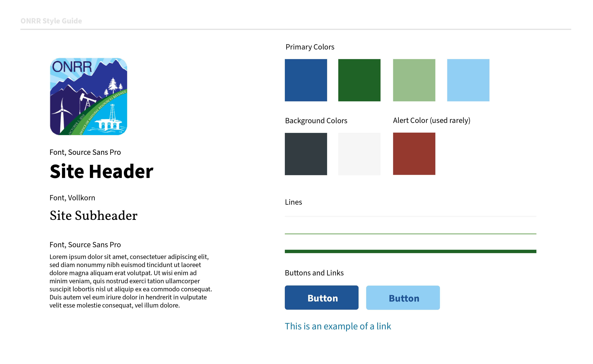

Hello everyone! I am, Alena Huang, a student at the University of Notre Dame studying Visual Communication Design. I joined the team as a User Experience Intern for 9 months during the school year.

## What I didn’t know when I started
Coming into the internship, I didn’t have too much experience in user experience, but it was something I was interested in. I had some experience in HTML/CSS and web design, but other than that, I had a lot to learn about UX!

## Projects I’ve worked on
I’ve learned about all the different aspects of user experience and how they all fit within the process of design.

### Content audit and sitemap
The very first thing that I worked on was a content audit and [sitemap](https://92ix0j.axshare.com/) for ONRR.gov. This was really helpful in understanding the content and getting a sense of the scale of the information that the ONRR website provided. It was so surprising to see how many files were available to the public!

Snapshots of the content audit:

### User research
Throughout the internship, I learned how not only to create questions for interviews, but also how to conduct user interviews and testing. I enjoyed user interviews because this is where you get a sense of how users interact with the product. After researching through user interviews, analysis reports (reports from old surveys, comparative analysis reports, etc.), and site analytics, my team and I were able to come up with [five personas](https://os2cz3.axshare.com/#id=yiu1lh&p=user_types&g=1) and their [user flows](https://os2cz3.axshare.com/#id=6yg8m7&p=user_type__operator&g=1) for ONRR.gov. Additionally, I recently created a card sort to better understand how users grouped information on the website!

One of the personas that we created, including pain points and main tasks:

### Visual design & interaction design
Earlier in my internship, I helped in brainstorming different ways to visualize data on the [Natural Resource Revenue Data website](https://revenuedata.doi.gov/), which is the data website that the ONRR team manages. Under the Explore data page, I helped design concepts for cards that will allow users to easily compare data between different states and regions. Near the end of my internship, I was able to redesign the [style guide](https://w8tuba.axshare.com/#id=8t2gzn&p=new_styles&g=1) of the ONRR website, including colors, fonts, and other UI elements. After creating the guide, I created prototypes for the [homepage](https://w8tuba.axshare.com/#id=fnhupi&p=home__template_&g=1), [contact page](https://w8tuba.axshare.com/#id=jbjfzs&p=contact__material_ui_&g=1), and [reporter checklist page](https://w8tuba.axshare.com/#id=vjdxod&p=checklist__material_ui_&g=1) that showcase basic visual design and information architecture.

Style tile:

## Favorite part
Although my internship was completely virtual, I enjoyed getting to know everyone on the ONRR team. Everyone is so welcoming and willing to teach me more about the process of developing a live, open-source government product. Whenever I went onto their conference calls for sync ups, they always included me in the conversation. I would especially like to thank Shannon McHarg and Lindsay Goldstein for being amazing mentors, as well as Annie Persson for being the best co-intern! I am incredibly thankful for everything that they have taught me and for giving me the opportunity to really dive deep into the process of user experience.

## What’s next
UX/UI Design is definitely on my radar; I am excited to take what I learned from this internship and use my skills in future projects!
