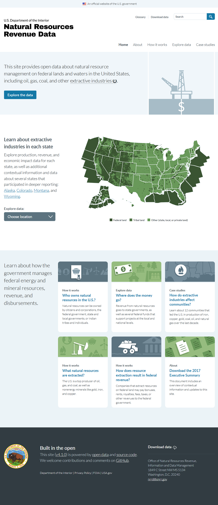
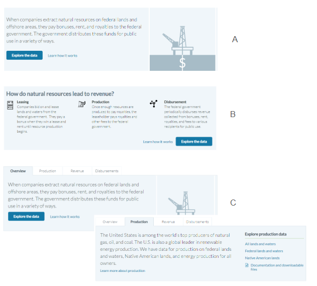

_This is part one of a two-part series about our homepage redesign. [Read part two here](/homepage-revamp-part-two/)._

Digital teams from [18F](https://18f.gsa.gov/) and the [Department of the Interior](https://www.doi.gov/) have been publishing government data about energy and mineral extraction on federal lands and waters since 2014. The [Natural Resources Revenue Data](https://revenuedata.doi.gov/) portal provides that open government data today.

Back in 2014, 18F built the site to support the federal government's participation in the [Extractive Industries Transparency Initiative](https://eiti.org/) (EITI). While the U.S. government decided to no longer formally implement the EITI Standard in November 2017, the department remains a strong supporter of the principles of transparency represented by the initiative.

Our small digital team at the [Office of Natural Resources Revenue](https://www.onrr.gov/) continues the work of user-centered and open-data design started by 18F.

## An interactive annual report

Conceived as an interactive version of the USEITI annual report, the scope of the site included data and information about the overall role of extractive industries in the U.S., not just on federal lands and waters. The site's homepage design emphasized contextual information over data presentation, even while offering a strong call to action to explore the data.

When our team took over management of the site, we knew we'd need to narrow the scope of the content, as we have limited resources relative to the EITI era. We also wanted to reevaluate user needs, focus on datasets only our organization could provide, and make sure we could validate the data.

### A data-only site

The Office of Natural Resources Revenue also maintained a separate "statistics" site – by way of a private contractor – that provided largely the same data as the USEITI site. While it included much of the same open data, the site's codebase was proprietary, and it lacked contextual information about the laws, regulations, and processes that govern the extraction of natural resources on federal lands and waters. This site was effective at presenting data, but it assumed users were already familiar with the context and processes behind the data.

We decided to conduct an early research round of this site's users to make sure we scoped their needs for future development of Natural Resources Revenue Data, understanding we would combine the two sites to limit redundancy. Many of those observations informed our later prototypes and research rounds.

## Reframing the site

We completed a full content audit of the site to generate a site inventory, evaluate readability and maintenance requirements, and determine which content was specific to USEITI.

Reviewing the content, we realized we needed to reframe our vision of the site to make sure we could deliver the most value to users.

### A new product vision

Before working on the homepage, we rewrote [our product vision](https://github.com/ONRR/doi-extractives-data/wiki/Product-framing) to help guide our work:

> We are informing policy debates and raising public awareness by building the definitive source of timely and useful data about how the government manages federal energy and mineral resources, revenue, and disbursements.

With this vision laying the foundation for our strategy, we set up interviews with active and potential users to test our assumptions and discover their needs.

## The role of the homepage

[Some have argued homepages aren't that important](https://theblog.adobe.com/ux-mythbusting-is-the-homepage-really-the-most-important-part-of-your-website/), or at least not as important as they used to be. The increased use of search and social media to convey users deeper into websites is evident, but most users we talked to still use our homepage as their primary starting point. Our analytics show it's the most visited page on our site, with 22% of site sessions in 2018.

## User research

Equipped with the knowledge that our homepage was valuable to our users, we set about prototyping and testing options with users. Our goal was to determine how our homepage could better serve the needs of users, whom we had segmented into four main user types:

- [Question answerer](https://github.com/ONRR/doi-extractives-data/blob/research/research/00_UserTypes/00_UserTypes.md#user-type-1-question-answerer)
- [Agenda supporter](https://github.com/ONRR/doi-extractives-data/blob/research/research/00_UserTypes/00_UserTypes.md#user-type-2-agenda-supporter)
- [Storyteller](https://github.com/ONRR/doi-extractives-data/blob/research/research/00_UserTypes/00_UserTypes.md#user-type-3-storyteller)
- [Domain learner](https://github.com/ONRR/doi-extractives-data/blob/research/research/00_UserTypes/00_UserTypes.md#user-type-4-domain-learner)

### First round

In addition to making our homepage more in line with our new strategy, we were getting requests from users who fall into our "domain learner" and "question answerer" user types. They wanted summarized numbers on the homepage so they wouldn't have to dig through the [Explore Data](https://revenuedata.doi.gov/explore/) page to find them. We [tested 6 options](https://github.com/ONRR/doi-extractives-data/blob/research/research/20_fledglingfox/Results.md) with users matching a variety of user types. We landed on a couple options to test in the second round.

### Second round

In the [second round of testing](https://github.com/ONRR/doi-extractives-data/blob/research/research/21_obliviousorangutan/Results.md), we included new users to make sure our additions didn't scare away those without a basic understanding of the data. We also hadn't done extensive testing on the existing homepage with new users. In addition, we tested with more domain learners to make sure we were meeting their needs. We learned that we needed to summarily explain the production, revenue, and disbursement process on the homepage and Explore Data page and landed on the best approach for the new summary information.

### Third round

We then [tested 3 concepts](https://github.com/ONRR/doi-extractives-data/blob/research/research/22_QuietQuail/Results.md) with additional content at the top of the homepage to explain the data and how the different pieces of data work together. We landed on one concept that worked best and also learned that general-public users are most likely to use the site to explore data related to their geographic area, so the map needed to come before the new summary information on the homepage.

### Final design

These three studies led us to the design we built. It better explains the process behind the data to those who are not intimately familiar with the subject matter, while also providing high-demand, summary data to domain learners and question answerers. Based on the findings from these studies, we also plan to simplify the structure and navigation of the Explore Data page and make it easier to understand how to intrepret and use the data.

## Coming in part two

In part two of our series on our homepage redesign, we'll cover how we built our homepage in [GatsbyJS](https://www.gatsbyjs.org/), as we transition the site's codebase from [Jekyll](https://jekyllrb.com/).