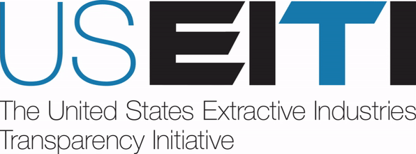

Over the years, I've found the discipline of content strategy to be...malleable. Sure, there are principles that guide the overarching approach, but the day-to-day mechanics of the job are shaped by the organization's culture, its mission, the composition of the team, and the history and trajectory of the product itself, among other variables.

Common to every content strategy I've developed is an unavoidable outcome: we must make tough content choices.

## A brief history

[Natural Resources Revenue Data](https://revenuedata.doi.gov/) was originally built by [18F](https://18f.gsa.gov/) to support the United States' participation in the [Extractive Industries Transparency Initiative](https://eiti.org/) (EITI). The site served as an interactive version of the EITI annual report, required by member countries of EITI.

In practice, here's what that meant for the site's content strategy:

- The [EITI standard](https://eiti.org/about/how-we-work#implementing-the-standard-nationally) mandates the formation of a multi-stakeholder group to define how EITI will work in the respective country. For the U.S., that meant, in part, that group formed the content governance for the site.
- The standard requires each country supply an independent administrator, a non-governmental entity to help coordinate the implementation of the standard. In our case, it was an outside contractor, the staff for which also developed much of the site's content.
- The scope of data and content under EITI went beyond the federal government's management and regulatory authority over extractive industries and included data and content related to the economic impact of the extractives sector on local economies and Gross Domestic Product.

Basically, The EITI standard provided the scope, vision, and governance for the site.

## A new reality

In late 2017, the [U.S. withdrew from EITI](https://revenuedata.doi.gov/about/#history). The site would live on, but the content strategy would need to change. 

Meanwhile, [18F was transitioning the work to our team](https://18f.gsa.gov/2018/05/01/lessons-from-an-18f-product-transition/). We no longer had a governance structure, outside content creators, the developers who built the site, or the EITI standard.

So what now? 😟

## Making tough content choices

